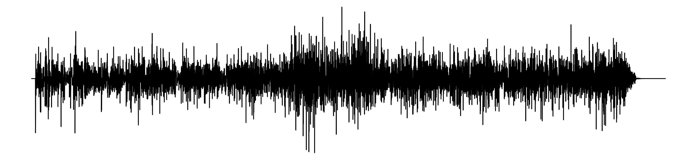

# ESPECTOGRAMA MUSICAL

Este código Python é feito para analisar e criar imagens que mostram o espectro de frequência da música desejada

## Imagem Final

</img>

## Funcionalidades

### Bibliotecas

```hcl
import numpy as np
import librosa
import matplotlib.pyplot as plt
from PIL import Image, ImageDraw, ImageFont
```

Importando as bibliotecas necessárias para o código

Para instalá-las:

`
python -m venv .venv
source .venv/bin/activate
pip install -r requirements.txt
`
### O que faz?

`Numpy`:
- Usado para processar o áudio (como normalização e redução da densidade).

`Librosa`:
- Biblioteca especializada em análise e manipulação de áudio.
- Ela carrega o áudio e extrai as informações necessárias para gerar o espectro.

`Matplotlib.pyplot`:
- Biblioteca para criar gráficos e visualizações.
- Utilizada para gerar o gráfico da waveform (linha contínua).

`Pillow`:
- Biblioteca para manipular imagens.
- Usada para desenhar os botões de áudio e combinar os elementos gráficos.

### Carregar o Áudio

```hcl
audio_path = "something.mp3"
audio_array, taxa_hz = librosa.load(audio_path, sr=None)
```

`librosa.load`:
- Carrega o arquivo de áudio mp3.
- `audio_path` caminho para o arquivo.
- `sr`: taxa de amostragem original
- `audio_array`: amostra de áudio ( array NumPy ).
- `taxa_hz`: variável que guarda a taxa de amostragem original.

### Reduzir Resolução do Áudio

```hcl
downsample_factor = 1000  # Fator de redução para simplificar os dados
y_downsampled = y[::downsample_factor]
```
`downsample_factor`:
- Define a quantidade de pontos do array a serem "pulados" para simplificar os dados.
- Exemplo: Se downsample_factor = 1000, apenas 1 ponto em cada 1000 será mantido.

`audio_array[::downsample_factor]`:
- Fatiamento de array: Seleciona elementos a cada `downsample_factor`.

### Normalizar o Áudio

```hcl
audio_array_normalized =audio_array_downsampled / np.max(np.abs(audio_array_downsampled))
```

`np.abs`:
- Calcula o valor absoluto de cada elemento do array.
- Exemplo: [-1, 0, 1] → [1, 0, 1].
- numpy.abs (https://numpy.org/doc/2.1/reference/generated/numpy.absolute.html).

`np.max`:
- Encontra o maior valor no array.
- numpy.max (https://numpy.org/doc/2.1/reference/generated/numpy.max.html).

`Normalização`:
- Divide cada elemento pelo valor máximo absoluto.
- Garante que os valores fiquem entre -1 e 1.

### Criar o Gráfico da Linha

```hcl
plt.figure(figsize=(12, 3))
plt.plot(y_normalized, color="black", linewidth=1)
plt.axis("off")
plt.tight_layout()
```

`plt.figure`:
- Cria uma nova figura para o gráfico.
- Argumento figsize: Define o tamanho da figura (largura, altura).
- plt.figure (https://matplotlib.org/stable/api/_as_gen/matplotlib.pyplot.figure.html).

`plt.plot`:
- Plota os valores do array como uma linha.
- Argumentos:
`y_normalized`: Dados do eixo Y.
`color`: Cor da linha.
`linewidth`: Espessura da linha.
- plt.plot (https://matplotlib.org/stable/api/_as_gen/matplotlib.pyplot.plot.html).

`plt.axis("off")`:
- Remove os eixos do gráfico.
- plt.axis (https://matplotlib.org/stable/api/_as_gen/matplotlib.pyplot.axis.html).

`plt.tight_layout`:
- Ajusta automaticamente os espaçamentos na figura.
- plt.tight_layout (https://matplotlib.org/stable/api/_as_gen/matplotlib.pyplot.tight_layout.html).
